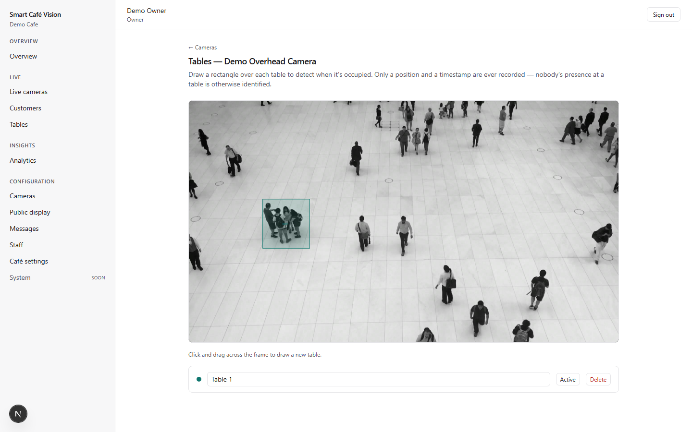
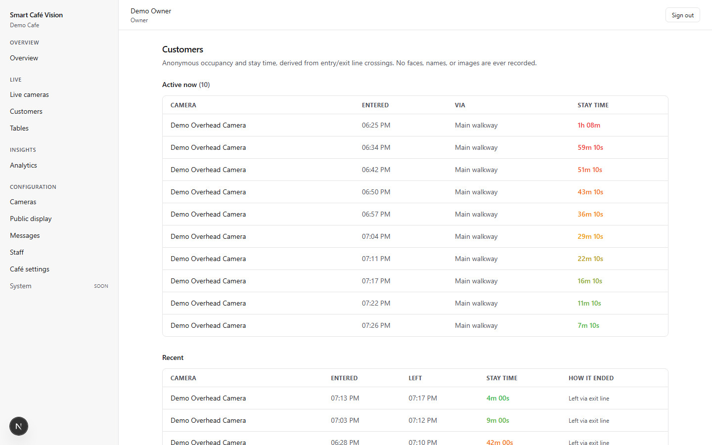
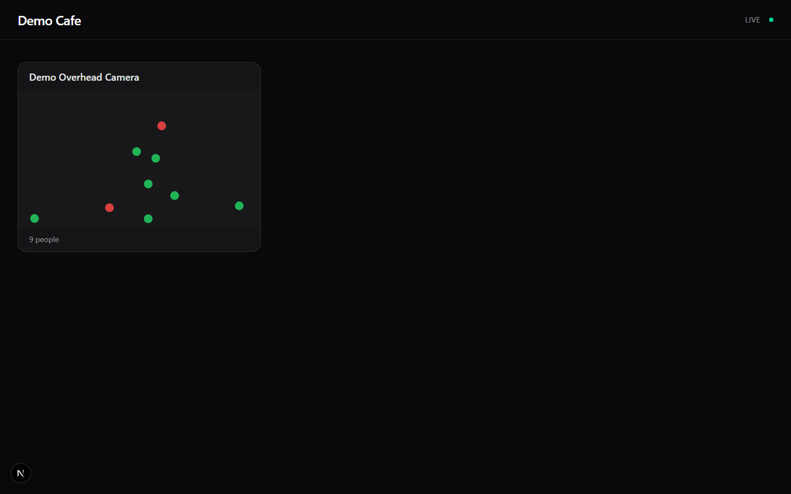
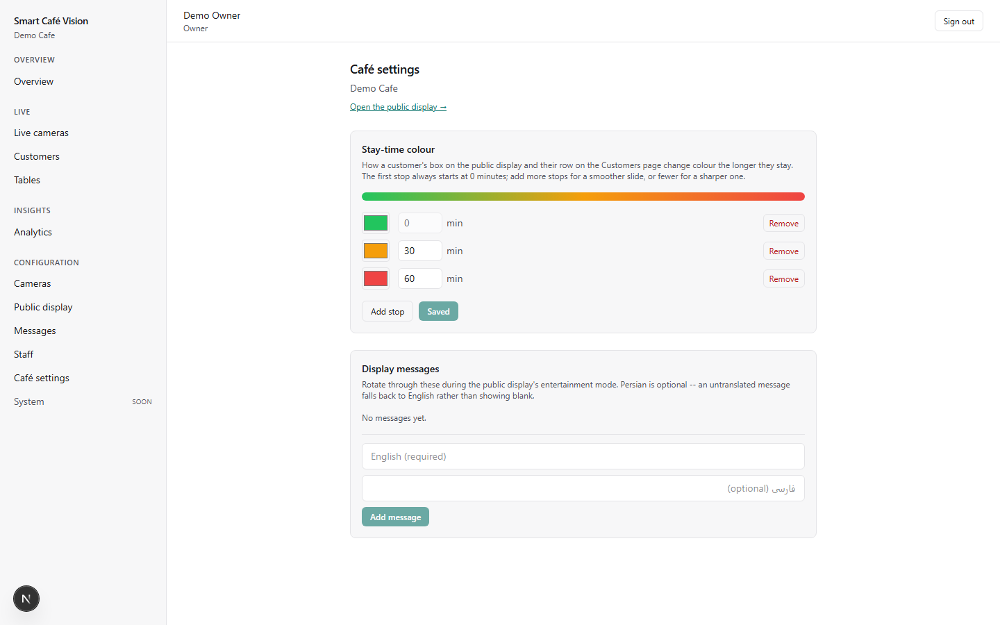
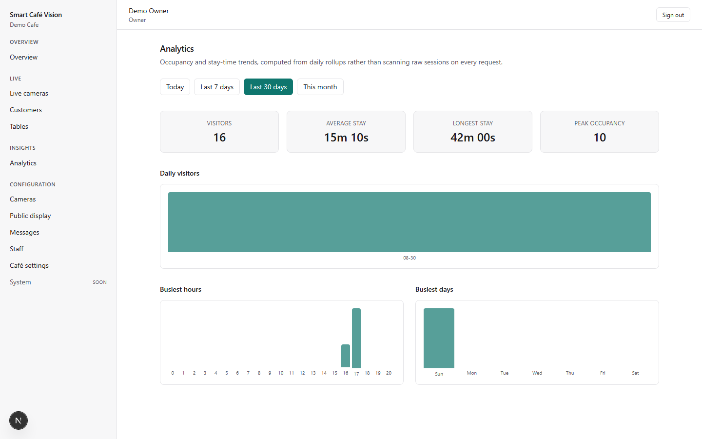
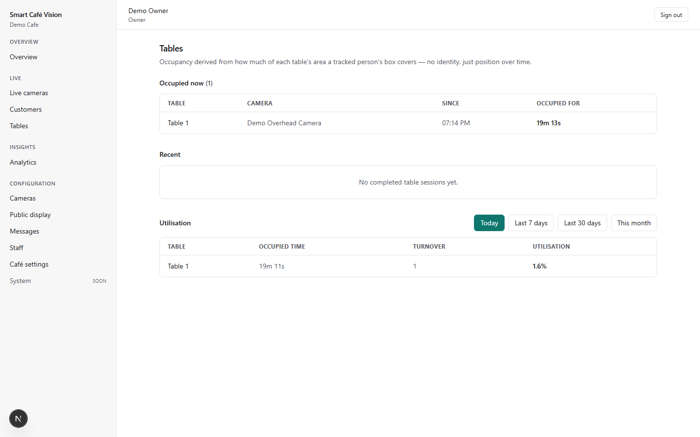

# Smart Café Vision

**Point a camera your café already has at the room, and get a dashboard that
knows how busy you are, how long people stay, and which tables are free —
without a single face ever being recognized or a single frame ever leaving
the building.**

<p align="center">
  
</p>

<p align="center"><em>That's a real screenshot. The people are a real overhead camera clip run through the actual YOLO detector, tracked live, with the table rectangle you see drawn by an owner in the dashboard — turning green the moment the system decides it's occupied.</em></p>

---

## What this actually does

Most cafés already have security cameras. This project turns them into
something useful without turning them into surveillance:

- 👥 **Counts people**, live, per room and per table — no headcount clicker, no guessing
- ⏱️ **Times every visit**, from the moment someone walks in to the moment they leave
- 🎨 **Colours it for you** — a customer's dot or row slides from green to amber to red the longer they've been there, so a glance tells you who might need a refill or a nudge
- 🪑 **Knows which tables are free**, drawn as simple rectangles on a camera snapshot — no sensors, no smart furniture
- 📊 **Rolls it all up** into daily trends: busiest hours, busiest days, average stay, peak occupancy
- 📺 **Shows it off** on a TV in the corner — a fun, anonymous public display for customers, not just a back-office dashboard

And the part that makes all of it safe to actually deploy:

> **Nobody is ever identified.** Not by name, not by face, not by anything.
> Every person becomes a temporary number the instant they're detected, and
> that number is thrown away the moment they leave. There is no facial
> recognition anywhere in this codebase — not disabled, not behind a flag,
> not "possible to add." It was never built, on purpose.
>
> **Nothing leaves your building.** The cameras, the AI, the database, the
> dashboard — all of it runs on a computer you own, on your own network.
> Unplug the internet and the café keeps working exactly the same. There is
> no cloud service this depends on.

---

## See it in action

<table>
<tr>
<td width="50%">

<br><sub>Every customer's stay time, colour-coded live — green when they arrive, sliding to red the longer they stay.</sub>
</td>
<td width="50%">

<br><sub>The same colour logic, shown as anonymous dots on a TV for customers to see — never real video, never a face.</sub>
</td>
</tr>
<tr>
<td width="50%">

<br><sub>You choose the colours and the timing — this gradient editor drives every colour shown anywhere in the product.</sub>
</td>
<td width="50%">

<br><sub>Daily trends computed from rollups, not scanned live — busiest hours, busiest days, and how long people actually stay.</sub>
</td>
</tr>
</table>

**How the table rectangle works:** you draw a box over a table once, on a
snapshot from the camera. From then on, the system measures how much of
that box a detected person's outline actually covers — not "is someone
standing near it," but "is someone genuinely sitting there." It's honest
about its limits, too: a camera mounted directly overhead gets a reliable
reading, one mounted on a wall gets a labelled approximation, and the app
tells you which one you have.

<p align="center">
  
</p>

---

## Try it yourself

You don't need a camera to see this working — a five-minute Docker setup
gets you a running dashboard, and you can point it at any RTSP stream
(including a looped video file) to watch detection happen live.

```bash
git clone https://github.com/Erfaani/smart-cafe-vision.git
cd smart-cafe-vision

cp .env.example .env
python scripts/generate_keys.py      # fills in the secrets

docker compose up -d --build
docker compose run --rm backend python manage.py bootstrap \
    --email you@example.com --cafe-name "My Café" --timezone Europe/Berlin
```

The bootstrap command prints a generated password once — save it. Then open
<http://localhost:3000> and sign in.

Adding the actual vision pipeline (the part that watches a camera) is one
more command, kept separate because it's a bigger, GPU-capable image:

```bash
docker compose -f docker-compose.yml -f docker-compose.ai.yml up -d ai-worker
```

Full walkthrough, including running without Docker at all:
[docs/installation.md](docs/installation.md).

---

## How it fits together

```
IP cameras ──RTSP──► AI worker ──Redis Stream──► event consumer ──► PostgreSQL
                         │                                              │
                         └──heartbeat──► Redis                          │
                                                              Django API ◄──── analytics
                                                                   │
                            ┌──────────────────────┼──────────────────────┐
                            ▼                      ▼                      ▼
                     Next.js dashboard      WebSocket push        public display
                        (staff)              (live updates)          (café TV)
```

- **The AI worker** is its own process (Python, OpenCV, YOLO via
  `ultralytics`, ByteTrack/BoT-SORT) — it reads camera frames, detects
  people, tracks them anonymously frame to frame, and publishes small,
  faceless events ("someone crossed this line," "this table is covered")
  to Redis.
- **Redis Streams**, not a simple queue — restarting the backend or losing
  power mid-shift never silently drops an event the way an in-memory queue
  would. Nothing about this project trusts a single moment in time to not
  fail.
- **Django + DRF + Channels** ingests those events, turns them into
  sessions and stats, and serves the API, the WebSocket, and the dashboard's
  data.
- **Next.js** is the dashboard staff use, the public display customers see,
  and the thin proxy layer between the two — the browser never talks to the
  AI worker or the database directly.

Full architecture write-up, including the reasoning behind every one of
those decisions: [docs/architecture.md](docs/architecture.md).

---

## Built for a real café, not a demo

This isn't a proof of concept — it went through eleven build phases, each
one shipped with real tests before moving on, and the last phase was
specifically about making it survivable in production, not just correct in
a test suite:

- **Backups** that are actually verified — a script that dumps the
  database, and a restore script proven against a real
  seed → backup → corrupt → restore → confirm round trip, not just written
  and hoped for.
- **A real security review** — logo uploads got a size cap they were
  missing, an unused error-tracking dependency got wired up properly
  (strictly opt-in, since this product promises to work with no internet
  at all), and the trade-offs that were reviewed and deliberately kept as-is
  are written down with the reasoning, not silently assumed.
- **Two ways to run it** — Docker Compose, or systemd units for a machine
  that shouldn't run a container runtime at all — with the same non-root,
  locked-down posture either way.
- **Honest limits, on purpose.** Table detection says outright when a
  camera's angle can only approximate, not guarantee, occupancy. The public
  display never shows real video, even to staff who are logged in on it.
  Nothing in the docs claims a capability the code doesn't actually have.

Every phase's full story — what was built, what broke during testing, and
how it got fixed — is in [docs/roadmap.md](docs/roadmap.md).

---

## Documentation

**If you're running a café**, not writing code:

- [Owner's guide](docs/owner-guide.md) — day-to-day use, written for whoever
  runs the café, not whoever installed the software

**If you're setting it up or building on it:**

- [Installation](docs/installation.md) — Docker and bare-metal setup
- [Architecture](docs/architecture.md) — how the pieces fit and why
- [Hardware](docs/hardware.md) — what to buy for 1, 4, 8, or 16 cameras
- [GPU setup](docs/gpu-setup.md) — NVIDIA Container Toolkit, CPU fallback
- [Production](docs/production.md) — backups, log rotation, resource limits,
  systemd, upgrading
- [Security review](docs/security-review.md) — what was checked, fixed, and
  deliberately left alone
- [Privacy](docs/privacy.md) — exactly what is and isn't stored, GDPR notes
- [Development](docs/development.md) — running tests, project conventions
- [Roadmap](docs/roadmap.md) — all eleven build phases, in full

API reference is generated from the code: `http://localhost:8000/api/docs/`
once it's running.

---

## Tech stack

| Layer | Stack |
|---|---|
| Backend | Django, Django REST Framework, Channels (ASGI), PostgreSQL, Redis |
| AI worker | Python, OpenCV, YOLO11 (`ultralytics`), ByteTrack / BoT-SORT |
| Frontend | Next.js, React, TypeScript, Tailwind CSS |
| Infra | Docker Compose, or systemd for a non-Docker install |

---

## Status

All eleven planned phases are complete and tested: architecture and the
event pipeline, RTSP camera integration, person detection, multi-object
tracking, entry/exit stay-time, the colour system, the public display, an
analytics dashboard, table occupancy analytics, production hardening, and a
final QA pass. See [docs/roadmap.md](docs/roadmap.md) for the detailed,
phase-by-phase story.

## Licence

Not yet chosen. Treat as all rights reserved until stated otherwise.
